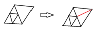
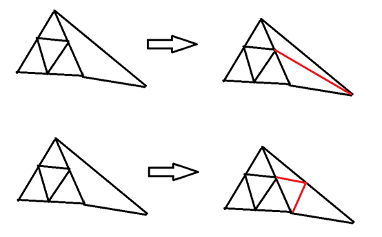
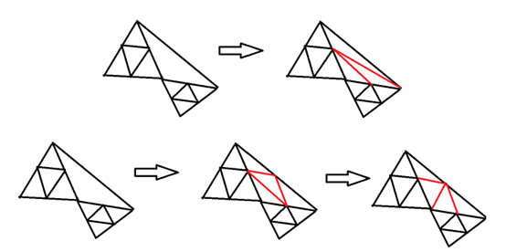
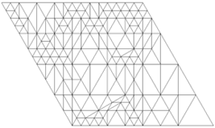
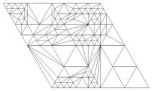

# 适合三角网格变形的自适应网格细分策略

本项目旨在研究并实现一种专用于网格变形（特别是基于拉普拉斯算子的方法）的自适应网格细分策略。该策略的核心目标是在保持原始几何特征、保证网格质量的前提下，动态、局部地增加网格分辨率，以支持高质量、高效率的交互式变形。

## 1. 工作背景

### 1.1. 变形需要高质量网格
网格变形，特别是基于微分坐标的方法（如拉普拉斯、泊松变形），其数值稳定性高度依赖于网格质量。这些方法的核心是构建和求解一个基于 **拉普拉斯算子 (Laplacian Operator)** 的线性方程组。这个算子依赖于顶点的邻域几何结构，在扭曲、退化的三角形（如细长条或含极大/极小角的三角形）上会变得 **病态 (ill-conditioned)**。一个病态的方程组会导致求解器出错，或得到充满噪声和严重失真的变形结果。

### 1.2. 变形需要自适应分辨率
在交互式变形中，用户通常只对模型的局部区域进行编辑。为了兼顾 **效率** 和 **表达能力**，理想的策略是仅在用户编辑区域或几何变化剧烈的区域动态增加网格密度，而在其他平坦、无变化的区域保持网格稀疏。全局统一的高密度网格会使变形求解过程变得异常缓慢，失去实时交互性。

### 1.3. 变形需要插值细分
拉普拉斯等变形方法的核心优势在于 **保持原始几何细节**。它通过预先编码每个顶点的“拉普拉斯坐标” **δ** 来实现这一点。因此，任何辅助性的细分都必须是 **插值 (Interpolating)** 的，即细分过程 **绝不能移动原始顶点的位置**，新生成的曲面必须精确穿过所有原始顶点。标准的 **逼近细分 (Approximating)**（如 Loop 或 Catmull-Clark）会平滑并破坏这些宝贵的细节，与变形算法的目标（保持 δ）背道而驰（改变 δ 使其趋向于零），故不可直接使用。

## 2. 主要挑战

*   **算法选择与实现：** 调研并选定一种合适的插值细分算法（如红绿细分、蝴蝶细分），分析其优缺点，并完成高质量的实现。
*   **局部细分与优化：** 如何将全局细分算法改造为局部自适应的？如何优化新生成三角形的质量，避免产生新的扭曲单元？
*   **质量评估与掩码定义：** 如何量化评估网格质量？如何定义触发局部细分的掩码（Mask）？是用户自定义，还是根据梯度、法向、曲率等几何信息自动生成？
*   **与变形算法的集成：** 当网格拓扑变化后，如何为新顶点计算合理的拉普拉斯坐标？如何高效地更新拉普拉斯矩阵？
*   **动态与交互性：** 如何将细分/粗化过程无缝集成到实时变形循环中，而不产生卡顿？

## 3. 核心思路

1.  **插值细分算法选择：**
    本项目将重点研究和实现两种主流的插值细分方案：
    *   **红绿细分 (Red-Green Refinement):** 规则简单，天生支持自适应，是实现基础功能的首选。
    *   **改进版蝴蝶细分 (Modified Butterfly Subdivision):** 规则复杂，但能生成更平滑、高质量的网格，作为进阶探索。

2.  **红绿细分优化策略：**
    > 原始的红绿细分在处理悬挂点时，可能会因为直接连接对角顶点而产生带有小角度的扭曲三角形。我的核心优化方案是：在对一个面进行绿色细分（处理悬挂点）之前，预先检测其内角。如果剖分会产生小于特定阈值（如 29.5°）的角，则不直接进行二分，而是先引入该面最长边的中点，再将此问题转化为一个更优的、悬挂点数为2或3的情况来处理，从而强制保证新生成三角形的质量。

3.  **效果评估与掩码生成：**
    *   **评估指标：** 使用细分后网格的顶点度数分布和平均度数，以及三角形质量度量（如半径比）来量化评估细分效果。
    *   **掩码定义：** 支持两种方式：
        *   **局部细分：** 用户手动指定一个点或面，系统对该区域及其邻域进行细分。
        *   **自适应掩码：** （后续目标）根据几何度量（如变形梯度、面积变化率）自动决定需要细分的区域。

## 4. 代码计划

1.  [x] `7.22` Loop 细分算法实现 (作为学习和对比)
2.  [x] `7.22 - 7.23` 基础红绿细分算法实现
3.  [x] `7.23 - 7.25` 红绿细分优化策略实现与测试
4.  [x] `7.24` 改进的蝴蝶细分算法实现
5.  [x] `7.22 - 7.26` 完成所有算法的测试并撰写报告

## 5. 进度记录

### 7.22
收到任务，初期理解为常规的曲面平滑，故实现了一个标准的 Loop 细分算法。后与导师沟通，明确了需求是为**网格变形**服务，核心要求是**保持原始几何形状**。随即否定了 Loop 这类逼近型细分方案，转向研究插值细分。了解到红绿细分方法非常适合此场景，开始着手实现。

### 7.23
在实现红绿细分时，最初的方案是在原始网格上直接进行点和面的增删，但发现拓扑操作复杂且容易出错。后将方案改为每次细分都创建一个全新的网格 `pMesh1`，并将结果输出，思路变得更加清晰。
*   **实现红色细分：** 基于静态掩码，对标记为 `true` 的面执行 1-4 分裂。
*   **实现绿色细分：** 自动检测悬挂顶点，并根据悬挂点数量（1, 2, 3）执行相应的分裂来修复拓扑。
*   **`n=2` 时的优化：** 对于悬挂点为2的情况，在三角化新生成的四边形时，采用了**最小化最大外接圆半径**的准则来选择对角线，替代了简单的边长准则，以追求更好的三角形质量。

### 7.23 - 7.25：核心优化方案
**问题来源：** 基础的红绿细分，尤其是在处理 `n=1` 的悬挂点时（如下图上半部分），通过连接对角顶点进行二分，很容易在钝角三角形中产生新的、角度更小的退化三角形。

> **优化方案：** 当一个角（如上图红线要剖分的角）要被剖分时，我们预先判断剖分后产生的新角度。如果新角度小于阈值（29.5°），则认为此次剖分不合理。我们转而**引入该角对边（最长边）的中点**，这样原问题就强制转化为一个悬挂点数为2的情况来处理，可以利用更优的三角化策略。

对于 `n=2` 的情况也采用类似的预判和处理，最终将问题都导向更易于优化的拓扑结构，并全局开启边翻转优化，使得最终的三角形尽可能正则。

## 6. 结果展示与分析

**注意：** 以下所有对比图中，左侧为**优化后 (pro)** 的算法结果，右侧为**原始**算法结果。

### 6.1 平面网格的对比

*   **初始对比**
    
    
    *原始细分（右）产生了大量不规则、扭曲的三角形，且部分顶点度数过高。优化后（左）的网格则非常规整。*

*   **优化效果展示**
    
    *优化后的方法（左）生成的三角形很好地贴合了原始等腰直角网格的形状，边缘过渡地带的顶点度数也更均匀。原始方法（右）则产生了明显的扭曲和不规则性。*

### 6.2 顶点度数分布对比

*   **平面细分10次**
    | Degree | Count (Optimized) | Count (Original) |
    |:------:|:-----------------:|:----------------:|
    |   10+  |        28         |       >500       |
    |    9   |        306        |        765       |
    |    8   |       7086        |       1789       |
    |    7   |       16246       |       3959       |
    |    6   |       48039       |      30673       |
    |    5   |       31943       |      13281       |
    | **Total Verts** |   **104,007**   |    **51,252**    |
    | **Avg. Degree** |   **~5.988**    |    **~5.988**    |

    *可以看到，优化后的算法产生了更合理的度数分布，消灭了大量的高（>10）低（<5）度顶点，使大部分顶点度数集中在理想的5, 6, 7度。但代价是总点数有所增加。*

*   **全局细分6次**
    
    *在全局细分这种理想情况下，优化算法（左）与原始算法（右）结果完全一致，证明了优化策略在不需要时不会引入任何不必要的点和面。*

### 6.3 三维模型对比

*   **正方体**
    
    *优化算法（左）在处理边界和角点时，度数分布更均匀，总点数也更少，网格质量更高。*

*   **斯坦福兔子**
    
    *在曲面模型上，优化算法（左）同样展现了更平滑的度数过渡和更好的网格结构。*

### 6.4 改进版蝴蝶细分 (Modified Butterfly) 结果
实现了改进的蝴蝶细分算法。作为一种插值细分，它保留了原始顶点，没有进行平滑更新，因此能保持原表面的尖锐特征。

从度数统计来看，蝴蝶细分的结果并没有想象中惊艳，其度数分布略好于原始红绿细分，但远不如优化后的红绿细分算法。其在网格变形中的实际应用效果还有待进一步测试。

## 7. 后续目标

1.  **实现自动掩码生成：** 设计一个简单的几何度量（如面片面积变化率或顶点位移梯度），当该度量超过阈值时，自动将该区域加入下一次细分的掩码中。
2.  **实现局部粗化（反向细分）：** 当某区域的变形趋于平缓时，能够安全地合并细分三角形，移除不必要的顶点，减小计算量。
3.  **制作小型拉普拉斯求解器：** 将细分后的网格用于网格变形中。使其能够在一个给定的、静态的、非均匀密度网格上正确构建拉普拉斯矩阵并求解。
4.  **实现完整变形流程：**
    `用户加载模型` -> `计算初始拉普拉斯坐标` -> `用户指定细分区域` -> `调用细分函数生成新网格` -> `在新网格上重新构建拉普拉斯矩阵` -> `用户拖动控制点` -> `求解变形`
